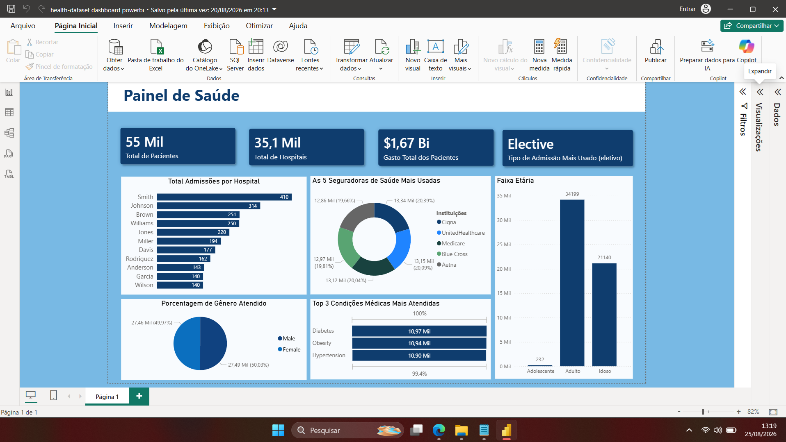

---

```markdown
# Dashboard de Saúde & Gestão Hospitalar — Power BI

## Visão Geral do Projeto
Este repositório contém um dashboard analítico interativo para **Gestão Hospitalar e Saúde (Healthcare Analytics)** desenvolvido no **Power BI Desktop**, integrado a um banco de dados **MySQL** local via **XAMPP**.

O objetivo principal foi transformar um conjunto de dados desnormalizado de atendimentos em um **Modelo Estrela (Star Schema)** limpo e performático, fornecendo visibilidade sobre faturamento hospitalar, volume de atendimentos, perfis demográficos e rankings operacionais.

---

## Preview do Dashboard



---

## Tecnologias e Ferramentas

* **Power BI Desktop:** Construção do relatório, design de UX/UI e lógica de negócios.
* **MySQL & XAMPP:** Banco de dados relacional hospedado localmente para armazenamento dos dados.
* **Power Query (M):** Extração, limpeza, desduplicação e modelagem dimensional de dados.
* **DAX (Data Analysis Expressions):** Criação de métricas de negócios, agregações dinâmicas e colunas de ordenação.

---

## Estrutura do Repositório

```text
healthcare-powerbi-dashboard/
│
├── .gitignore
├── README.md
│
├── data/
│   ├── raw/
│   │   └── healthcare_dataset.csv       # Dataset original
│   └── sql/
│       └── schema.sql                   # Scripts de criação/carga no MySQL
│
├── pbix/
│   └── Healthcare_Analytics.pbix        # Arquivo principal do Power BI
│
└── docs/
    └── screenshots/
        ├── dashboard_overview.png       # Print da tela do Dashboard
        └── data_model.png               # Modelo Estrela (Relacionamentos)

```

---

## Indicadores e Visuais Implementados

### 1. Cartões de Métricas Principais (KPIs)

* **Total de Pacientes:** 55 Mil pacientes únicos atendidos na rede.


* **Total de Hospitais:** 35,1 Mil instituições mapeadas e padronizadas na base.


* **Gasto Total dos Pacientes:** Faturamento bruto acumulado de **$1,67 Bilhão**.


* **Tipo de Admissão Mais Usado:** Identificação da modalidade **Elective** (Eletiva) como a predominante.


### 2. Análises Operacionais & Médicas

* **Top 10 Hospitais:** Ranking das instituições com visual limpo e sem poluição de eixos.


* **Top Atendimentos por Médico:** Ranking dos profissionais com maior volume de internações (liderado por *Smith* com 410 e *Johnson* com 314).


* **Top 3 Condições Médicas:** Concentração dos diagnósticos mais comuns: *Diabetes* (10,97 Mil), *Obesity* (10,94 Mil) e *Hypertension* (10,90 Mil).


* **As 5 Seguradoras Mais Usadas:** Distribuição do volume entre *Cigna*, *UnitedHealthcare*, *Medicare*, *Blue Cross* e *Aetna*.


### 3. Perfil Demográfico dos Pacientes

* **Distribuição por Faixa Etária:** Análise dos atendimentos divididos por fases da vida (*Adolescente*: 232, *Adulto*: 34.199 e *Idoso*: 21.140) com ordenação cronológica via DAX.


* **Distribuição por Gênero:** Divisão demográfica equilibrada entre *Male* (50,03% / 27,49 Mil) e *Female* (49,97% / 27,46 Mil).


---

## Principais Desafios & Soluções Técnicas

1. **Tratamento de Entidades no Power Query:**
* *Problema:* Sufixos corporativos (`Inc`, `Group`, `Ltd`, `PLC`) geravam entidades duplicadas e distorciam a contagem de hospitais.
* *Solução:* Limpeza de texto via **Substituição de Valores** e **Lapar (Trim)** no Power Query para unificar o cadastro.


2. **Eliminação de Registros `(Em branco)`:**
* *Problema:* Desalinhamento entre os nomes limpos na dimensão e as chaves originais na fato deixavam milhares de atendimentos sem vínculo.
* *Solução:* Realização de **Mesclagem de Consultas** entre a fato e a dimensão padronizada no Power Query para repassar as chaves `ID Hospital` corretas.


3. **Ordenação Lógica de Categorias de Texto:**
* *Problema:* O Power BI ordenava as faixas etárias alfabeticamente (*Adolescente, Adulto, Idoso*).
* *Solução:* Criação de uma coluna numérica de apoio em DAX (`Ordem Faixa Etaria`) utilizando a função `SWITCH` e reclassificação da coluna via **Classificar por coluna**.


---

## Fórmulas DAX Destacadas

* **Faturamento Total:**
```dax
Faturamento Total = SUM(fato_admissoes[Billing_Amount])

```


* **Tipo de Admissão Mais Usado:**
```dax
Tipo Admissao Mais Usado = 
TOPN(
    1, 
    VALUES(fato_admissoes[Admission_Type]), 
    CALCULATE(COUNTROWS(fato_admissoes)), 
    DESC
)

```


* **Categorização por Faixa Etária:**
```dax
Faixa Etaria = 
SWITCH(
    TRUE(),
    fato_admissoes[Age] >= 12 && fato_admissoes[Age] <= 17, "Adolescente",
    fato_admissoes[Age] >= 18 && fato_admissoes[Age] <= 59, "Adulto",
    fato_admissoes[Age] >= 60, "Idoso",
    "Não informado"
)

```


---

## Como Executar o Projeto Localmente

1. Clone este repositório:
```bash
git clone [https://github.com/brvnas/healthcare-powerbi-dashboard.git](https://github.com/brvnas/healthcare-powerbi-dashboard.git)

```


2. Baixe e importe o banco de dados `healthcare_dataset` no seu servidor MySQL via XAMPP.
3. Abra o arquivo `Healthcare_Analytics.pbix` localizado na pasta `pbix/`.
4. Atualize as credenciais de conexão do MySQL em **Transformar Dados > Configurações da fonte de dados** apontando para o seu `localhost`.

```

```